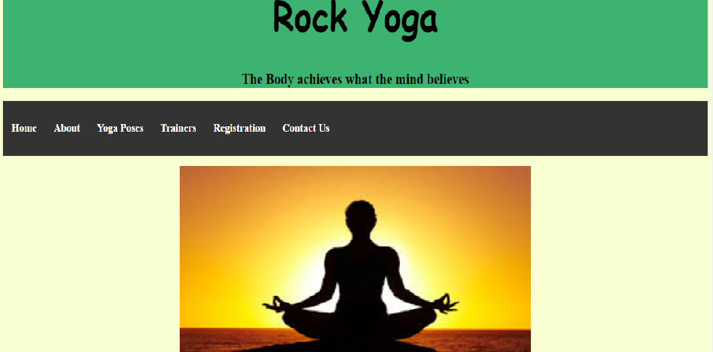
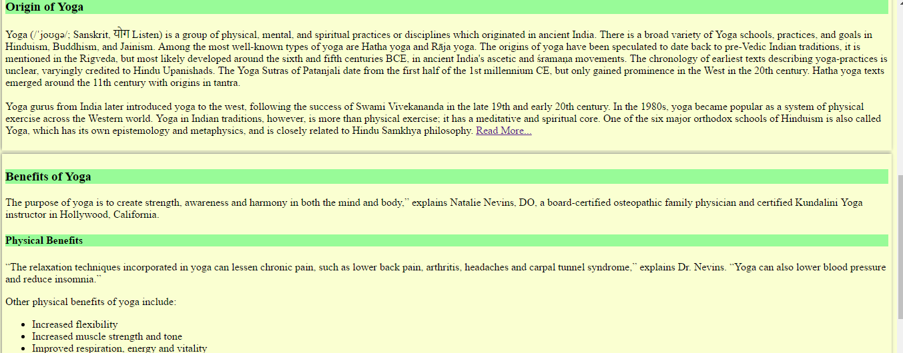
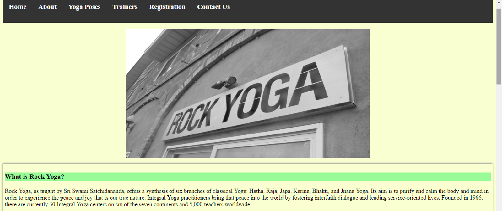
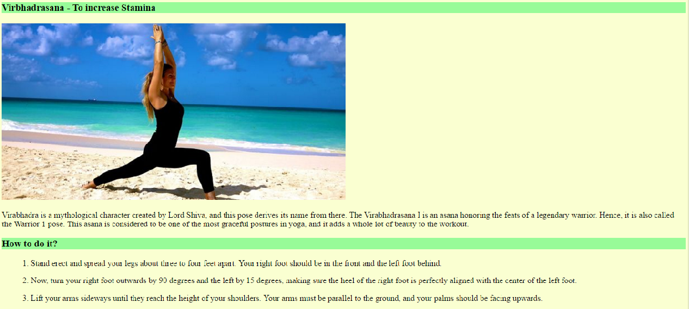
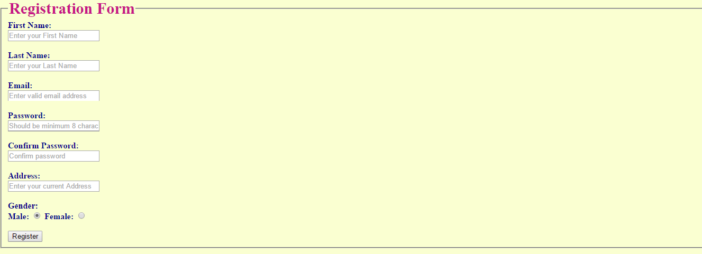
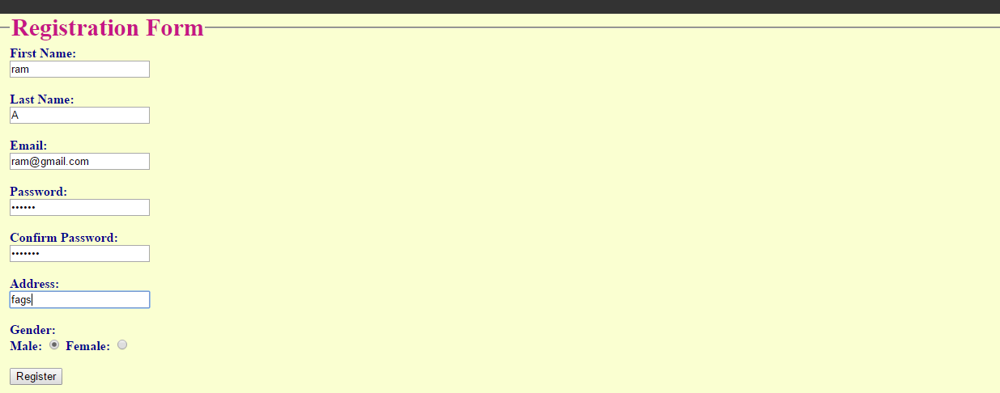
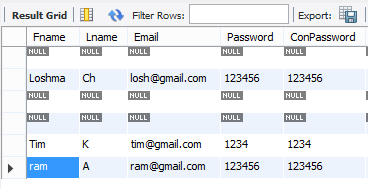
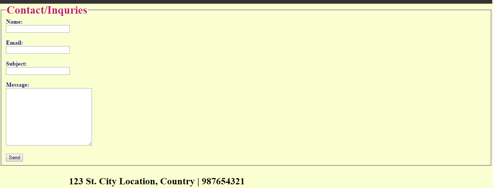

# Webpage-Yoga
This is the basic web page developed using HTML, CSS, JavaScript, Spring.
* Created HTML files(index.html, about.html, poses.html, trainers.html, registration.html, contact.html) to develop pages.
* Created CSS file(style.css) to add styling to HTML files.
* Created JavaScript file(scroll.js) for scrolling images in Home page.
* Created Java files(Yoga.java, TestUtil.java) inorder to connect to database.

### This Webpage consists 6 pages:
* Home
* About
* Yoga Poses
* Trainers
* Registration
* Contact Us

# Home
Home page consists scrolling images with description about the image and it consists information about "Origin of Yoga" and "Benefits of Yoga"

# About
About page contains information about "Rock Yoga" like what is Rock Yoga?, About Rock Yoga, Branches of Rock Yoga...etc.

# Yoga Poses
This page contains information about different poses in Yoga, How to practice those poses and benefits of that Yoga Pose which is very informative.

# Trainers
This page consists information about Yoga Trainers and their Experience.

# Registration
New users can register by using this page. They have to give the following details:
* First Name
* Last Name
* Email
* Password
* Address
* Gender

When you give your information your data is stored in Database.

# Contact Us
Whenever you want to contact "Rock Yoga" you can go to this page give your Name, Email, Subject and Message about what you are contacting for and click "send".

